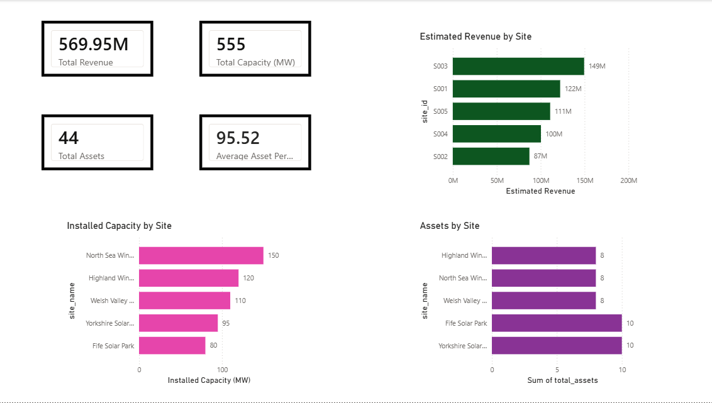

# Renewable Energy Performance Analytics

## Project Overview

This project analyzes renewable energy site and asset performance using BigQuery, SQL, and Power BI.

The goal was to identify top-performing sites, evaluate asset efficiency against expected generation, and estimate revenue based on market electricity prices.

## Tools Used

- Google BigQuery
- SQL
- Power BI
- GitHub

## Dataset

The project uses simulated renewable energy operational data including:

- Sites
- Assets
- Energy Generation
- Market Prices
- Maintenance Events
- Weather Data

## Business Questions

- Which sites generate the most energy?
- Which sites generate the most revenue?
- Which assets perform best against expected generation?
- How does installed capacity vary across sites?

## SQL Analysis

### Site Asset Analysis

- Counted assets by site
- Calculated installed capacity by site

### Generation Performance Analysis

- Actual vs expected generation
- Asset performance ranking
- Site performance benchmarking

### Revenue Analysis

- Estimated revenue by site
- Revenue ranking using window functions

## Power BI Dashboard



## Key Insights

- Total installed capacity: 555 MW
- Total assets: 44
- Estimated revenue: £569.95M
- Average asset performance: 95.52%
- Site S003 generated the highest estimated revenue

## Repository Structure

```text
data/
├── raw/
└── cleaned/

sql/
docs/
powerbi/
```

## Author

Sharon Karmal Louis
